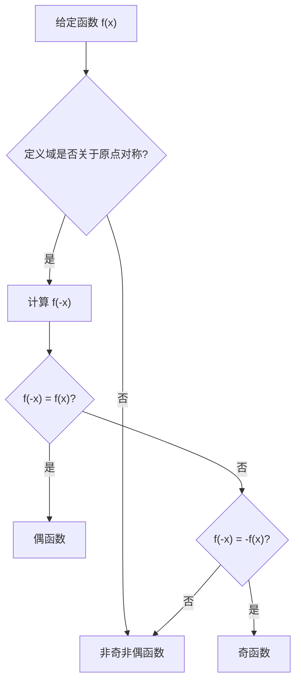

---
tags:
  - note笔记
  - math数学
  - AI-generated
  - AI-generated人工智能生成
created: 2026-08-19
updated: 2026-08-22
status: 进行中
priority: 中
source: AI
type: 笔记
subject: 数学
chapter: 函数
---

# 3 函数

> [!abstract] 章节定位
> 同济高数第一章第 1 节，是 [[2 映射]] 的延续。考研大纲明确要求：理解函数概念、掌握表示法；了解四大性质并**会判断**；理解复合函数与分段函数；了解反函数与隐函数；掌握基本初等函数的性质与图形（详见 [[4 基本初等函数]]）。
> 
> 本笔记属于考研数学主线：[[1 数学基础|数学]] → [[2 映射]] → **函数** → [[5 数列的极限]] → [[6 收敛数列的性质]] → [[连续]]

## 一、函数的概念

- **定义**：设 $D \subset \mathbb{R}$ 是非空实数集，若存在法则 $f$，使对每个 $x \in D$ 都有**唯一确定**的 $y \in \mathbb{R}$ 与之对应，则称 $f$ 为定义在 $D$ 上的（一元）函数，记作 $y = f(x)$
- 函数是映射的特例：数集到数集的映射（衔接 [[2 映射]]：定义域 $D$、值域 $R_f = f(D)$、到达域与值域的关系）
- 自变量记号无关性：$f(x) = x^2$ 与 $f(t) = t^2$ 是**同一个函数**

> [!important] 两要素
> 函数由**定义域 + 对应法则**两个要素决定。考研常考「两个式子是否为同一函数」：
> - $y = x$ 与 $y = \dfrac{x^2}{x}$ **不是**同一函数（定义域不同：后者 $x \ne 0$）
> - $y = \sqrt{x^2}$ 与 $y = x$ **不是**同一函数（对应法则不同：前者 $=|x|$）

## 二、函数的表示法

- **解析法**：显式 $y = f(x)$；隐式 $F(x, y) = 0$；参数式 $\begin{cases} x = \varphi(t) \\ y = \psi(t) \end{cases}$
- **表格法 / 图像法**
- **分段函数**：定义域上分区间用多个式子表示——考研高频，注意分段点处的取值必须按对应分段的表达式代入
- **隐函数**：由方程 $F(x,y)=0$ 确定的函数（如 $x^2 + y^2 = 1$），考研中常与求导结合（衔接 [[导数]]）

## 三、函数的四大性质
### 1. 有界性

- **定义**：$\exists M > 0$，使得 $|f(x)| \le M$ 对一切 $x \in D$ 成立
- **几何**：图像夹在两条水平线 $y = \pm M$ 之间

```desmos-graph
left=-4; right=4; top=1.8; bottom=-1.8;
width=578; height=260;
---
y=\sin(x)|blue
y=1|red|dashed
y=-1|red|dashed
```

*图 1：$y = \sin x$ 的图像被 $y = \pm 1$（红色虚线）完全夹住——在 $\mathbb{R}$ 上有界*

> [!warning] 有界性依赖考察范围（定义域的子/同集）
> 「有界/无界」不带限定语时，指在整个**定义域**上考察；带限定语（如「在 $(0,1)$ 上」）时，指在定义域的**子区间**上考察——定义域是固定的（函数两要素），考察范围是可选的子集。
> $y = \dfrac{1}{x}$ 在其定义域 $\mathbb{R} \setminus \{0\}$ 上**无界**，限制到 $(0, 1)$ 仍无界，限制到 $[1, +\infty)$ 则**有界**（$M=1$）；$y = x^2$ 在 $\mathbb{R}$ 上无界，但在 $[0, 1]$ 上有界。

### 2. 单调性

- **定义**：对定义域内任意 $x_1 < x_2$，$f(x_1) < f(x_2)$ 为单调增；$f(x_1) \le f(x_2)$ 为不减（单调减 / 不增类似）
- 区分「单调」与「**严格单调**」；考研中常用**求导**判断（衔接 [[导数]] 与 [[微分]]）

```desmos-graph
left=-2; right=2; top=5; bottom=-0.5;
width=247; height=340;
---
y=e^x|red
y=e^{-x}|blue
```

*图 2：$y = e^x$（红）在 $\mathbb{R}$ 上严格单调递增，$y = e^{-x}$（蓝）严格单调递减（曲线超出窗口顶部的部分保持同样趋势）*

### 3. 奇偶性

- **定义**：定义域关于原点对称的前提下，$f(-x) = f(x)$ 为偶函数，$f(-x) = -f(x)$ 为奇函数
- **几何**：偶函数图像关于 $y$ 轴对称；奇函数图像关于原点对称

```desmos-graph
left=-1.8; right=1.8; top=2.6; bottom=-2.6;
width=235; height=340;
---
y=x^2|blue
y=x^3|red
```

*图 3：$y = x^2$（蓝）偶——关于 $y$ 轴对称；$y = x^3$（红）奇——关于原点对称*

- **运算性质**：奇 × 奇 = 偶；偶 × 偶 = 偶；奇 × 偶 = **奇**（常考易错）
- 奇函数在对称区间上的积分为 0（衔接定积分）；奇函数的反函数仍为奇函数（证明见 [[2 映射]] 第三节）

#### 3.1 奇偶性的判断方法

> [!tip] 判断奇偶性的「三步法」
> 1. **看定义域**：定义域必须关于原点对称（即 $x \in D \Rightarrow -x \in D$）
> 2. **算 $f(-x)$**：将函数表达式中的 $x$ 全部替换为 $-x$
> 3. **比较 $f(-x)$ 与 $f(x)$**：
>    - 若 $f(-x) = f(x)$ → **偶函数**
>    - 若 $f(-x) = -f(x)$ → **奇函数**
>    - 若都不满足 → **非奇非偶**
>    - 若同时满足 → **既奇又偶**（只有 $f(x)=0$ 这种情况）

**详细判断流程**：



> [!important] 第一步是关键
> 很多同学直接算 $f(-x)$，忽略了定义域对称性的检验。如果定义域不对称，**直接判断为非奇非偶**，无需计算！
>
> **典型反例**：$f(x) = \sqrt{x}$，定义域 $[0, +\infty)$ 不关于原点对称 → **非奇非偶**（不是偶函数，尽管 $\sqrt{(-x)^2} = \sqrt{x^2} = |x| \neq \sqrt{x}$）

##### 例 1：多项式函数

> 判断 $f(x) = x^4 + 2x^2 + 1$ 的奇偶性

**解**：
1. **定义域**：$\mathbb{R}$，关于原点对称 ✔
2. **计算 $f(-x)$**：
   $$f(-x) = (-x)^4 + 2(-x)^2 + 1 = x^4 + 2x^2 + 1 = f(x)$$
3. **结论**：$f(-x) = f(x)$ → **偶函数**

> [!tip] 多项式函数的快速判断
> 只看各项次数：
> - **全是偶次项**（常数视为 $x^0$）→ **偶函数**
> - **全是奇次项** → **奇函数**
> - **既有奇次又有偶次** → **非奇非偶**（除非能化简）
>
> 例：$x^6 + x^4 + 1$ 偶；$x^5 + x^3 + x$ 奇；$x^2 + x$ 非奇非偶

##### 例 2：分式函数

> 判断 $f(x) = \dfrac{x}{1+x^2}$ 的奇偶性

**解**：
1. **定义域**：$1+x^2 > 0$ 恒成立，定义域 $\mathbb{R}$，关于原点对称 ✔
2. **计算 $f(-x)$**：
   $$f(-x) = \frac{-x}{1+(-x)^2} = \frac{-x}{1+x^2} = -\frac{x}{1+x^2} = -f(x)$$
3. **结论**：$f(-x) = -f(x)$ → **奇函数**

##### 例 3：含绝对值的函数

> 判断 $f(x) = |x+1| + |x-1|$ 的奇偶性

**解**：
1. **定义域**：$\mathbb{R}$，关于原点对称 ✔
2. **计算 $f(-x)$**：
   $$f(-x) = |-x+1| + |-x-1| = |x-1| + |x+1| = f(x)$$
   （利用 $|{-a}| = |a|$）
3. **结论**：$f(-x) = f(x)$ → **偶函数**

> [!tip] 绝对值函数的处理技巧
> 利用性质 $|-a| = |a|$，将 $f(-x)$ 中的绝对值内部取反，常能快速化简

##### 例 4：指数与对数函数

> 判断 $f(x) = e^x + e^{-x}$ 与 $g(x) = e^x - e^{-x}$ 的奇偶性

**解**：

| 函数 | $f(-x)$ 计算 | 结论 |
|------|-------------|------|
| $f(x) = e^x + e^{-x}$ | $f(-x) = e^{-x} + e^x = f(x)$ | **偶函数** |
| $g(x) = e^x - e^{-x}$ | $g(-x) = e^{-x} - e^x = -(e^x - e^{-x}) = -g(x)$ | **奇函数** |

> [!note] 双曲函数
> 这两个函数在高等数学中有专门名称：
> - **双曲余弦** $\cosh x = \dfrac{e^x + e^{-x}}{2}$（偶函数）
> - **双曲正弦** $\sinh x = \dfrac{e^x - e^{-x}}{2}$（奇函数）
>
> 它们满足 $\cosh^2 x - \sinh^2 x = 1$（对比三角恒等式 $\cos^2 x + \sin^2 x = 1$）

##### 例 5：对数函数

> 判断 $f(x) = \ln(x + \sqrt{1+x^2})$ 的奇偶性

**解**：
1. **定义域**：需要 $x + \sqrt{1+x^2} > 0$。由于 $\sqrt{1+x^2} > \sqrt{x^2} = |x| \ge -x$，所以 $x + \sqrt{1+x^2} > 0$ 恒成立。定义域 $\mathbb{R}$，关于原点对称 ✔
2. **计算 $f(-x)$**：
   $$f(-x) = \ln(-x + \sqrt{1+(-x)^2}) = \ln(-x + \sqrt{1+x^2})$$
   考虑 $f(x) + f(-x)$：
   $$f(x) + f(-x) = \ln(x + \sqrt{1+x^2}) + \ln(-x + \sqrt{1+x^2})$$
   $$= \ln\left[(x + \sqrt{1+x^2})(-x + \sqrt{1+x^2})\right]$$
   $$= \ln\left[(\sqrt{1+x^2})^2 - x^2\right] = \ln(1+x^2-x^2) = \ln 1 = 0$$
   所以 $f(-x) = -f(x)$
3. **结论**：**奇函数**

> [!warning] 考研高频考点
> $f(x) = \ln(x + \sqrt{1+x^2})$ 是**奇函数**，这个结论在积分计算中非常有用：
> - 奇函数在对称区间 $[-a, a]$ 上的积分为 0
> - 例：$\displaystyle\int_{-1}^{1} \ln(x + \sqrt{1+x^2}) \, dx = 0$

#### 3.2 常见函数的奇偶性速查表

| 函数 | 奇偶性 | 说明 |
|------|--------|------|
| $x^n$（$n$ 为正整数） | $n$ 偶 → 偶；$n$ 奇 → 奇 | 看幂次 |
| $|x|$ | 偶 | $|-x| = |x|$ |
| $\sin x$ | 奇 | $\sin(-x) = -\sin x$ |
| $\cos x$ | 偶 | $\cos(-x) = \cos x$ |
| $\tan x$ | 奇 | $\tan(-x) = -\tan x$ |
| $\cot x$ | 奇 | $\cot(-x) = -\cot x$ |
| $\arcsin x$ | 奇 | $\arcsin(-x) = -\arcsin x$ |
| $\arctan x$ | 奇 | $\arctan(-x) = -\arctan x$ |
| $\arccos x$ | 非奇非偶 | 值域 $[0,\pi]$ 不对称 |
| $e^x$ | 非奇非偶 | 指数函数（$a>0, a\neq 1$）均非奇非偶 |
| $a^x + a^{-x}$ | 偶 | 特例：$e^x + e^{-x} = 2\cosh x$ |
| $a^x - a^{-x}$ | 奇 | 特例：$e^x - e^{-x} = 2\sinh x$ |
| $\ln x$ | 非奇非偶 | 定义域 $(0, +\infty)$ 不对称 |
| $\ln(x+\sqrt{1+x^2})$ | 奇 | 考研高频（见例 5） |
| $f(x) = C$（常数） | 偶 | $f(-x) = C = f(x)$；若 $C=0$ 则既奇又偶 |

> [!tip] 速记口诀
> - **三角函数**：sin、tan、cot 奇；cos 偶
> - **反三角**：arcsin、arctan 奇；arccos 非奇非偶
> - **指数**：$a^x$ 非奇非偶；$a^x \pm a^{-x}$ 看符号
> - **对数**：$\ln x$ 非奇非偶；$\ln(x+\sqrt{1+x^2})$ 奇（记住这个！）

#### 3.3 分段函数的奇偶性判断

> [!warning] 分段函数必须逐段验证
> 分段函数判断奇偶性时，需要**对每一段分别计算 $f(-x)$**，然后验证是否满足奇偶性条件。

##### 例 6：经典分段函数

> 判断 $f(x) = \begin{cases} x+1, & x > 0 \\ 0, & x = 0 \\ x-1, & x < 0 \end{cases}$ 的奇偶性

**解**：
1. **定义域**：$\mathbb{R}$，关于原点对称 ✔
2. **分段计算 $f(-x)$**：
   - 当 $x > 0$ 时，$-x < 0$，所以 $f(-x) = (-x) - 1 = -(x+1) = -f(x)$ ✔
   - 当 $x = 0$ 时，$f(-0) = f(0) = 0 = -0 = -f(0)$ ✔
   - 当 $x < 0$ 时，$-x > 0$，所以 $f(-x) = (-x) + 1 = -(x-1) = -f(x)$ ✔
3. **结论**：对所有 $x$ 都有 $f(-x) = -f(x)$ → **奇函数**

> [!tip] 分段函数判断技巧
> 画出函数图像可以快速判断：如果图像关于原点对称就是奇函数，关于 $y$ 轴对称就是偶函数

```desmos-graph
left=-4; right=4; top=4; bottom=-4;
width=400; height=300;
---
y=x+1|x>0|blue
y=x-1|x<0|red
(0,0)|open|label:(0,0)
```

*图 3a：例 6 的图像——关于原点对称，确认为奇函数*

#### 3.4 复合函数的奇偶性判断

复合函数 $h(x) = f(g(x))$ 的奇偶性取决于内外层函数的奇偶性组合：

| 外层 $f$ | 内层 $g$ | 复合 $f(g(x))$ |
|----------|----------|----------------|
| 偶 | 偶 | **偶** |
| 偶 | 奇 | **偶** |
| 奇 | 偶 | **偶** |
| 奇 | 奇 | **奇** |

> [!important] 复合函数奇偶性口诀
> **「偶偶得偶，偶奇得偶，奇偶得偶，奇奇得奇」**
>
> 简化记忆：**有偶则偶，双奇才奇**

**证明（以「奇+奇→奇」为例）**：
设 $f$ 是奇函数，$g$ 是奇函数，则：
$$h(-x) = f(g(-x)) = f(-g(x)) = -f(g(x)) = -h(x)$$
所以 $h$ 是奇函数。其他情况类似可证。

##### 例 7：复合函数奇偶性

> 判断 $h(x) = \sin(x^2)$ 的奇偶性

**解**：
- 外层 $f(u) = \sin u$ 是奇函数
- 内层 $g(x) = x^2$ 是偶函数
- 根据「奇偶得偶」→ $h(x)$ 是**偶函数**

验证：$h(-x) = \sin((-x)^2) = \sin(x^2) = h(x)$ ✔

#### 3.5 奇偶性的运算性质

> [!tip] 四则运算的奇偶性
> 假设 $f(x)$ 和 $g(x)$ 都是定义在对称区间 $D$ 上的函数：

| 运算 | 奇偶性规则 | 例子 |
|------|-----------|------|
| $f \pm g$ | 同奇则奇，同偶则偶，否则非奇非偶 | $x + x^2$ 非奇非偶 |
| $f \cdot g$ | 奇×奇=偶，偶×偶=偶，奇×偶=奇 | $x \cdot \sin x$ 偶 |
| $f / g$ | 同乘法规则（$g \neq 0$） | $\dfrac{\sin x}{x}$ 偶 |
| $|f|$ | 若 $f$ 奇，则 $|f|$ 偶 | $|\sin x|$ 偶 |
| $f^2$ | 无论 $f$ 奇或偶，$f^2$ 都是偶 | $\sin^2 x$ 偶 |

> [!warning] 常考易错点
> - **奇 + 奇 = 奇**，但 **奇 + 偶 = 非奇非偶**（不是「奇偶」）
> - **奇 × 偶 = 奇**，很多同学记反了
> - $f(x) + f(-x)$ 一定是**偶函数**（无论 $f$ 是什么）
> - $f(x) - f(-x)$ 一定是**奇函数**（无论 $f$ 是什么）

##### 例 8：利用奇偶性分解函数

> 任意函数 $f(x)$ 都可以分解为一个偶函数与一个奇函数之和：
> $$f(x) = \underbrace{\frac{f(x) + f(-x)}{2}}_{\text{偶函数}} + \underbrace{\frac{f(x) - f(-x)}{2}}_{\text{奇函数}}$$

**验证**：
- 设 $G(x) = \dfrac{f(x) + f(-x)}{2}$，则 $G(-x) = \dfrac{f(-x) + f(x)}{2} = G(x)$ → 偶函数
- 设 $H(x) = \dfrac{f(x) - f(-x)}{2}$，则 $H(-x) = \dfrac{f(-x) - f(x)}{2} = -H(x)$ → 奇函数

> [!note] 这个分解公式的意义
> 1. 证明了「任意函数 = 偶部 + 奇部」
> 2. 在傅里叶级数中有重要应用（偶部对应余弦项，奇部对应正弦项）
> 3. 考研中偶尔出现：已知 $f(x) + f(-x) = g(x)$，求 $f(x)$ 的奇偶性等

#### 3.6 考研高频技巧

##### 技巧 1：利用奇偶性简化计算

> 计算 $\displaystyle\int_{-\pi}^{\pi} (x^3 + \sin x) \cos x \, dx$

**解**：
- $x^3 \cos x$：$x^3$ 奇，$\cos x$ 偶 → 乘积**奇** → 在 $[-\pi, \pi]$ 上积分为 0
- $\sin x \cos x$：$\sin x$ 奇，$\cos x$ 偶 → 乘积**奇** → 在 $[-\pi, \pi]$ 上积分为 0
- 所以原式 $= 0 + 0 = 0$

> [!tip] 定积分中的奇偶性
> 若 $f(x)$ 在 $[-a, a]$ 上可积：
> - $f$ 为奇函数 → $\displaystyle\int_{-a}^{a} f(x) \, dx = 0$
> - $f$ 为偶函数 → $\displaystyle\int_{-a}^{a} f(x) \, dx = 2\int_{0}^{a} f(x) \, dx$

##### 技巧 2：利用奇偶性求函数值

> 已知 $f(x) = ax^5 + bx^3 + cx + 1$，$f(2) = 5$，求 $f(-2)$

**解**：
设 $g(x) = ax^5 + bx^3 + cx$，则 $g(x)$ 是奇函数，且 $f(x) = g(x) + 1$

由 $f(2) = g(2) + 1 = 5$ 得 $g(2) = 4$

所以 $g(-2) = -g(2) = -4$

故 $f(-2) = g(-2) + 1 = -4 + 1 = -3$

##### 技巧 3：抽象函数的奇偶性判断

> 已知 $f(x+y) = f(x) + f(y)$ 对一切实数成立，且 $f(x)$ 不恒为零，判断 $f(x)$ 的奇偶性

**解**：
1. 令 $x = y = 0$：$f(0) = f(0) + f(0) \Rightarrow f(0) = 0$
2. 令 $y = -x$：$f(0) = f(x) + f(-x) \Rightarrow 0 = f(x) + f(-x)$
3. 所以 $f(-x) = -f(x)$ → **奇函数**

> [!warning] 考研常见抽象函数条件
> - $f(x+y) = f(x) + f(y)$ → 通常为奇函数（如 $f(x) = kx$）
> - $f(xy) = f(x) + f(y)$ → 通常为对数型（如 $f(x) = \ln x$）
> - $f(xy) = f(x) \cdot f(y)$ → 通常为幂函数型（如 $f(x) = x^n$）

### 4. 周期性

- **定义**：$\exists T > 0$，使 $f(x + T) = f(x)$ 对一切 $x \in D$ 成立；存在时称最小正周期
- 常见周期：$\sin x$、$\cos x$ 周期 $2\pi$；$\tan x$、$\cot x$ 周期 $\pi$
- **注意**：周期函数未必有最小正周期（如常数函数，任意正数都是周期）

> [!tip] 性质判断口诀
> - **有界**看区间：图像能否被两条水平线夹住
> - **单调**看求导：$f'(x)$ 符号不变（或回归定义用 $x_1 < x_2$ 比较）
> - **奇偶**看对称：先验定义域关于原点对称，再看 $f(-x)$ 与 $f(x)$ 的关系
> - **周期**看平移：$f(x+T) = f(x)$ 是否对某 $T$ 成立

## 四、复合函数

- 衔接 [[2 映射]]：$y = f(u)$，$u = g(x)$，可复合条件 $R_g \subseteq D_f$
- **定义域**：$f(g(x))$ 的定义域 = $\{x \mid x \in D_g \text{ 且 } g(x) \in D_f\}$——两个条件取交集
- 考研高频题型：求复合函数定义域；由复合关系反求外层或内层函数

> [!example] 经典例子：$f(x) = \sqrt{x}$，$g(x) = 1 - x^2$
> - **$f \circ g$**：$f(g(x)) = \sqrt{1-x^2}$。$D_g = \mathbb{R}$，但要求 $g(x) = 1-x^2 \ge 0$（落在 $D_f = [0,+\infty)$ 内）⟹ **定义域压缩为 $[-1,1]$**——这正是 $R_g = (-\infty,1] \not\subseteq D_f$ 的后果
> - **$g \circ f$**：$g(f(x)) = 1 - (\sqrt{x})^2 = 1-x$。$R_f = [0,+\infty) \subseteq D_g = \mathbb{R}$ ✔ 条件满足 ⟹ 定义域就是 $D_f$ 本身 $[0,+\infty)$，不压缩
> - **结论**：$D_{f \circ g} = [-1,1] \ne D_{g \circ f} = [0,+\infty)$——复合顺序不同，定义域不同，正是 [[2 映射#七、自查|映射自查第 3 题]] 的具体反例
> - 图像上：$f \circ g$ 的曲线只在 $x \in [-1,1]$ 上存在（见下图）

```desmos-graph
left=-1.5; right=1.5; top=1.8; bottom=-0.5;
width=365; height=280;
---
y=\sqrt{1-x^2}|blue
(-1,0)|open|label:(-1,0)
(1,0)|open|label:(1,0)
```

*图 4：$f(g(x)) = \sqrt{1-x^2}$ 的图像——半径为 1 的上半圆，仅存在于定义域 $[-1,1]$ 上（端点 $(\pm1, 0)$）*

## 五、反函数

- **存在条件**：双射（见 [[2 映射]] 的分类与图 2 的水平线判别法）
- $y = f(x)$ 与 $x = f^{-1}(y)$ 在坐标平面上是**同一张图像**；$y = f(x)$ 与 $y = f^{-1}(x)$ 关于直线 $y = x$ 对称
- **求法**：从 $y = f(x)$ 解出 $x$，再交换 $x$、$y$ 的位置，并写出反函数定义域（= 原函数值域）
- 详细内容见 [[反函数]]

## 六、考点与易错点

### 考点清单

- [ ] 同一函数的判断（定义域 + 对应法则）
- [ ] 定义域求法（偶次根式、分母、对数真数、$\arcsin x$ 自变量范围，多条件取交集）
- [ ] 四大性质的判断（结合图形与口诀）
- [ ] 复合函数定义域
- [ ] 基本初等函数的图形与性质（详见 [[4 基本初等函数]]）

> [!warning] 高频易错点
> - **定义域必须写成集合或区间形式**，多条件用交集
> - $\sqrt{x^2} = |x|$，不是 $x$
> - 分段函数在分段点处按对应分段的表达式代入
> - 有界性依赖考察范围（默认为定义域，也可取子区间）：$\dfrac{1}{x}$ 在 $(0,1)$ 无界，在 $[1,+\infty)$ 有界
> - 偶 × 奇 = **奇**，不是偶
> - $f(x) = x^2$ 与 $f(x) = x^2$（$x \ge 0$）不是同一函数——两要素缺一不可

## 七、自查

> [!question] 学完自测
> 1. $y = \dfrac{x^2-1}{x-1}$ 与 $y = x+1$ 是同一函数吗？
> 2. $f(x) = x + \sin x$ 的奇偶性？（提示：奇 + 奇 = 奇）
> 3. $\sin x$ 在 $\mathbb{R}$ 上有界吗？$\tan x$ 呢？
> 4. $f(x) = \sqrt{x^2 - 1}$，$g(x) = \ln x$，求 $f(g(x))$ 的定义域

> [!success]- 参考答案
> **1.** 不是同一函数。$y = \dfrac{x^2-1}{x-1}$ 在 $x=1$ 处无定义（分母为零），定义域为 $\mathbb{R} \setminus \{1\}$；$y = x+1$ 的定义域是 $\mathbb{R}$。两者定义域不同，不满足"两要素相同"，故不是同一函数。虽然在 $x \ne 1$ 时两式相等，但 $x=1$ 这一个点就足以区分。
>
> **2.** 奇函数。$f(-x) = (-x) + \sin(-x) = -x - \sin x = -(x + \sin x) = -f(x)$。依据：奇函数 + 奇函数 = 奇函数（$x$ 是奇函数，$\sin x$ 也是奇函数）。
>
> **3.** $\sin x$ 在 $\mathbb{R}$ 上有界：$|\sin x| \le 1$，$\forall x \in \mathbb{R}$。$\tan x$ 在 $\mathbb{R}$ 上**无界**：当 $x \to \dfrac{\pi}{2}^-$ 时 $\tan x \to +\infty$，当 $x \to \dfrac{\pi}{2}^+$ 时 $\tan x \to -\infty$。注意 $\tan x$ 在 $\mathbb{R}$ 上不连续（在 $x = \dfrac{\pi}{2} + k\pi$ 处无定义），无界性来自趋于无穷的行为。
>
> **4.** $f(g(x)) = \sqrt{(\ln x)^2 - 1}$。需要同时满足：① $g(x) = \ln x$ 有意义 $\implies x > 0$；② $g(x)$ 落在 $f$ 的定义域内 $\implies (\ln x)^2 - 1 \ge 0 \implies |\ln x| \ge 1 \implies \ln x \ge 1$ 或 $\ln x \le -1 \implies x \ge e$ 或 $0 < x \le \dfrac{1}{e}$。综上，定义域为 $\left(0, \dfrac{1}{e}\right] \cup [e, +\infty)$。

---

> 📅 **最后更新**：2026-08-22
> 
> 📚 **相关笔记**：[[2 映射]] | [[4 基本初等函数]] | [[5 数列的极限]]
