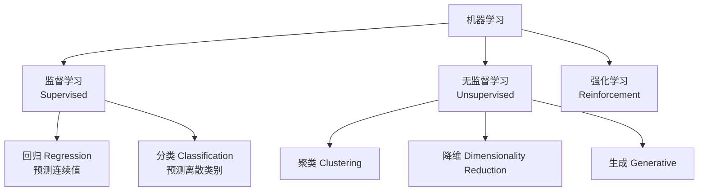

---
tags:
  - note笔记
  - ds数据结构
  - AI-generated人工智能生成
aliases:
  - "机器学习类型"
  - "监督学习无监督学习强化学习"
created: "2026-08-24"
updated: "2026-08-24"
status: 待复习
type: 笔记
subject: 数据结构
---

# 📊 机器学习的类型

> 本篇整理自课程听讲笔记，梳理机器学习的三大类型及其子方向。

---

## 一、基本概念

### 1.1 数据相关术语

| 术语 | 定义 | 示例（房价预测） |
|------|------|------------------|
| **数据集（Dataset）** | 完整的数据表格 | 整张房价数据表 |
| **数据点/样本（Sample）** | 数据集中的单条记录 | 每一行 = 一套房子 |
| **特征（Feature）** | 数据的一个属性/性质 | 面积、楼层、距地铁距离、房龄 |
| **维度（Dimension）** | 特征的数量 | 5 个特征 → 5 维数据 |
| **标签（Label）** | 模型要预测的变量 | 房价（最后一列） |

> [!info] 结构化数据
> 可以用 Excel 或数据库表存储的数据，每行代表一个实体，每列代表一个属性。

---

## 二、机器学习三大类型总览



| 类型 | 数据特点 | 目标 | 典型应用 |
|------|----------|------|----------|
| **监督学习** | 有标签 | 根据特征预测标签 | 房价预测、垃圾邮件检测 |
| **无监督学习** | 无标签 | 发现数据内部隐藏结构 | 用户分群、数据降维 |
| **强化学习** | 动态环境交互 | 通过试错学习最优策略 | 自动驾驶、游戏 AI |

---

## 三、监督学习（Supervised Learning）

### 3.1 核心思想

根据**带标签**的历史数据，学习特征与标签之间的映射关系，对新数据进行预测。

$$\text{预测} = f(\text{特征}_1, \text{特征}_2, \ldots, \text{特征}_n)$$

### 3.2 两种子类型

| 子类型 | 标签类型 | 输出 | 典型算法 | 应用 |
|--------|----------|------|----------|------|
| **回归（Regression）** | 连续数值 | 具体数字 | 线性回归、多项式回归、岭回归 | 房价预测、股票价格 |
| **分类（Classification）** | 离散类别 | 类别标签 | 逻辑回归、决策树、随机森林、SVM、KNN | 垃圾邮件检测、图像识别 |

### 3.3 回归 vs 分类

| 对比维度 | 回归 | 分类 |
|----------|------|------|
| **标签类型** | 连续数值（有意义的数字） | 离散类别（用数字表示类型，无数量含义） |
| **示例** | 房价 = 250 万 | 猫 = 0，狗 = 1 |
| **输出** | $y = 2.5$（可解释为具体数值） | $y = 0$ 或 $1$（仅表示类别） |
| **数字含义** | 100 万和 200 万有差异 | 猫=0、狗=1 或猫=10、狗=20 均可 |
| **评价指标** | MSE、MAE、$R^2$ | 准确率、精确率、召回率、F1 |

> [!info] 回归的词源
> "回归"来自统计学——高尔顿发现身高极高/极矮的父母，其子女身高倾向于向群体均值靠拢，称为"回归均值"。在机器学习中，回归指通过数据建模找到变量间的映射关系，实现连续数值预测。

---

## 四、无监督学习（Unsupervised Learning）

### 4.1 核心思想

处理**无标签**数据，让模型自动探索特征，发现数据内部的结构、模式或规律。

### 4.2 为什么需要无监督学习？

- 带标签数据的**标注成本极高**（需要人工逐条标注）
- 现实中绝大部分数据是**没有标签**的
- 可以为监督学习做**数据预处理和分析**

### 4.3 三种子类型

#### 4.3.1 聚类（Clustering）

将相似的数据自动分组，实现"物以类聚"。

| 特性 | 说明 |
|------|------|
| **目标** | 根据数据相似度自动分组 |
| **输入** | 无标签的特征数据 |
| **输出** | 分组结果（用机器来实现"打标"） |
| **典型算法** | K-Means、DBSCAN、层次聚类 |

**K-Means 算法简述**：

1. 随机选择 $k$ 个初始聚类中心
2. 将每个数据点分配到最近的聚类中心
3. 重新计算每个聚类的中心（均值）
4. 重复步骤 2-3，直到中心不再变化

> [!example] 电商用户分群
> 100 万用户的访问交易数据 → 无监督聚类 → 自动分为"价格敏感型"、"品牌忠诚型"等用户画像 → 精准推荐

#### 4.3.2 降维（Dimensionality Reduction）

在尽量不丢失关键信息的前提下，简化数据维度。

| 特性 | 说明 |
|------|------|
| **目标** | 压缩特征数量，去除噪声和冗余 |
| **方法** | 合并相似特征、删除无关特征、投影到低维空间 |
| **典型算法** | PCA（主成分分析）、t-SNE、UMAP |

**PCA（主成分分析）简述**：

- 找到数据方差最大的方向（主成分）
- 将数据投影到这些方向上
- 保留最重要的几个主成分，丢弃其余

> [!example] 房价特征降维
> "距地铁站距离"、"周边学校数量"、"商场个数"几十个特征 → PCA 降维 → 合并为一个"综合地段评分" → 训练效率大幅提升

#### 4.3.3 生成（Generative）

从现有数据中学习分布规律，创作全新的内容。

| 特性 | 说明 |
|------|------|
| **目标** | 生成逼真的新数据 |
| **典型技术** | GAN（生成对抗网络）、VAE（变分自编码器）、Diffusion Model |
| **应用** | AI 绘画（Midjourney、Stable Diffusion）、数据增强、隐私保护下的合成数据 |

> [!example] 医疗 AI 数据增强
> 病人隐私数据不能随意分享 → 用生成算法合成逼真的病理切片 → 扩充训练集

---

## 五、强化学习（Reinforcement Learning）

### 5.1 核心思想

智能体在**动态环境**中不断试错，通过环境的奖励/惩罚反馈，学习最优策略。

### 5.2 运行机制

```
┌──────────┐    动作(Action)    ┌──────────────┐
│  智能体   │ ────────────────→ │     环境      │
│ (Agent)  │ ←──────────────── │(Environment) │
└──────────┘   反馈(Reward)     └──────────────┘
```

### 5.3 关键概念

| 概念 | 定义 | 示例（自动驾驶） |
|------|------|------------------|
| **智能体（Agent）** | 做决策的主体 | 自动驾驶汽车 |
| **环境（Environment）** | 智能体所处的外部世界 | 道路、交通信号、其他车辆 |
| **动作（Action）** | 智能体可执行的操作 | 转向、加速、刹车 |
| **奖励（Reward）** | 环境对动作的反馈信号 | 安全行驶 +1，撞墙 -100 |
| **策略（Policy）** | 从状态到动作的映射规则 | 遇红灯 → 停车 |
| **状态（State）** | 环境的当前情况 | 当前车速、前方障碍物距离 |

### 5.4 里程碑案例

| 案例 | 时间 | 方法 | 意义 |
|------|------|------|------|
| **AlphaGo** | 2016 | 深度神经网络 + 强化学习 + 蒙特卡洛树搜索，学习人类棋谱 | 击败围棋世界冠军李世石（4:1） |
| **AlphaGo Zero** | 2017 | 完全自我对弈，仅告知规则，不参考人类棋谱 | 3 天超越 AlphaGo，证明无需人类知识 |
| **AlphaZero** | 2017 | 泛化版 AlphaGo Zero，适用于围棋、国际象棋、将棋 | 通用博弈 AI |

> [!tip] AlphaGo → AlphaGo Zero → AlphaZero 的演进
> - **AlphaGo**（2016）：学习人类棋谱 + 强化学习
> - **AlphaGo Zero**（2017）：完全从零自我对弈，不看人类棋谱，3 天超越 AlphaGo
> - **AlphaZero**（2017）：将自我对弈方法泛化到多种棋类游戏

### 5.5 应用场景

- 游戏 AI（LOL、王者荣耀的 AI 对手）
- 机器人姿态控制、工业机械臂调度
- 量化交易策略
- **大语言模型的 RLHF**：训练后用强化学习与人类意图对齐（如 ChatGPT）

> [!info] RLHF（Reinforcement Learning from Human Feedback）
> 大语言模型训练的最后一步：用人类反馈的强化学习，让模型的输出更符合人类偏好。人类标注员对模型的多个回答进行排序，训练奖励模型，再用强化学习优化语言模型。

---

## 六、三大类型对比总结

| 维度 | 监督学习 | 无监督学习 | 强化学习 |
|------|----------|------------|----------|
| **数据** | 有标签 | 无标签 | 动态环境交互 |
| **目标** | 预测标签 | 发现结构 | 学习最优策略 |
| **反馈** | 标签即反馈（显式） | 无显式反馈 | 奖励/惩罚（延迟反馈） |
| **典型任务** | 回归、分类 | 聚类、降维、生成 | 决策、控制 |
| **代表算法** | 线性回归、逻辑回归、SVM | K-Means、PCA、GAN | Q-Learning、PPO、DQN |
| **数据获取** | 历史数据 | 历史数据 | 与环境交互产生 |

---

## 🔗 关联笔记

- [[01-机器学习概述]] - AI/ML/DL 关系与发展
- [[03-线性回归]] - 监督学习的基础算法
- [[04-梯度下降]] - 模型优化的核心方法
- [[843知识清单]] - 843专业课整体框架
